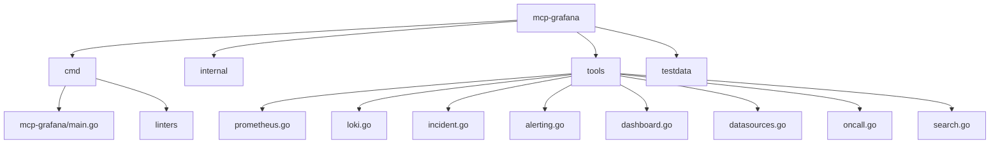
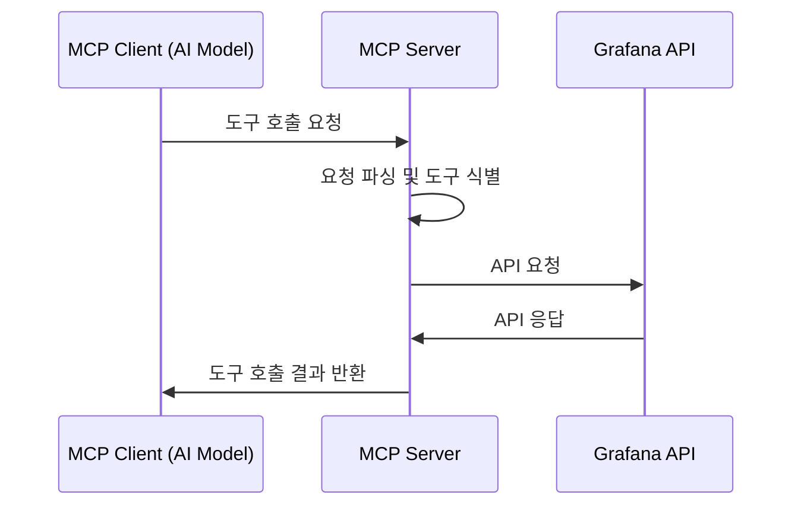

# MCP Grafana 프로젝트 구조 분석

이 문서는 MCP(Model Context Protocol) API가 Grafana와 어떻게 상호작용하는지 분석합니다.

## 프로젝트 개요

MCP Grafana는 AI 모델(예: Claude)이 Grafana 인스턴스 및 그 생태계에 접근할 수 있도록 하는 Model Context Protocol(MCP) 서버입니다. 이 프로젝트는 LLM(Large Language Model)이 Grafana의 다양한 기능(대시보드 검색, 데이터소스 조회, 알림 관리 등)을 사용할 수 있게 해주는 도구 모음을 제공합니다.

## 프로젝트 구조

### 주요 구성 요소

1. **mcpgrafana.go**: 프로젝트의 핵심 기능을 제공하는 파일로, Grafana API와의 통신을 담당합니다.
2. **tools 디렉토리**: 다양한 Grafana 기능에 접근하기 위한 도구들(Prometheus, Loki, 알림 등)이 구현되어 있습니다.
3. **cmd/mcp-grafana/main.go**: MCP 서버를 시작하는 진입점입니다.

## MCP API와 Grafana 통신 방식

### 통신 흐름 상세 분석

1. **MCP 클라이언트(AI 모델)에서 서버로 요청**:
   - AI 모델이 특정 도구(예: `search_dashboards`, `query_prometheus` 등)를 호출합니다.
   - 요청은 JSON 형식으로 필요한 매개변수를 포함합니다.

2. **MCP 서버 내부 처리**:
   - 서버는 요청을 파싱하고 해당 도구를 식별합니다.
   - `mcpgrafana.go`에서는 Grafana URL과 API 키를 컨텍스트에서 가져옵니다.
   - 도구별 핸들러 함수가 호출됩니다.

3. **Grafana API 호출**:
   - 도구 핸들러는 Grafana API 클라이언트를 사용하여 실제 Grafana API를 호출합니다.
   - HTTP 요청에 인증을 위한 Bearer 토큰이 포함됩니다.

4. **응답 처리 및 반환**:
   - Grafana API 응답을 파싱하여 표준화된 형식으로 변환합니다.
   - 결과는 MCP 클라이언트(AI 모델)에 JSON 형식으로 반환됩니다.

## 주요 도구 및 기능

MCP Grafana는 다양한 Grafana 기능에 접근하기 위한 여러 도구를 제공합니다:

```mermaid
graph TD
    MCP[MCP Grafana] --> Search[검색 도구]
    MCP --> Dashboard[대시보드 도구]
    MCP --> Datasources[데이터소스 도구]
    MCP --> Prometheus[Prometheus 도구]
    MCP --> Loki[Loki 도구]
    MCP --> Alerting[알림 도구]
    MCP --> Incident[인시던트 도구]
    MCP --> OnCall[OnCall 도구]

    Search --> search_dashboards
    Dashboard --> get_dashboard_by_uid
    
    Datasources --> list_datasources
    Datasources --> get_datasource_by_uid
    Datasources --> get_datasource_by_name
    
    Prometheus --> query_prometheus
    Prometheus --> list_prometheus_metric_metadata
    Prometheus --> list_prometheus_metric_names
    Prometheus --> list_prometheus_label_names
    Prometheus --> list_prometheus_label_values
    
    Loki --> query_loki_logs
    Loki --> list_loki_label_names
    Loki --> list_loki_label_values
    Loki --> query_loki_stats
    
    Alerting --> list_alert_rules
    Alerting --> get_alert_rule_by_uid
    
    Incident --> list_incidents
    Incident --> create_incident
    Incident --> add_activity_to_incident
    Incident --> resolve_incident
    
    OnCall --> list_oncall_schedules
    OnCall --> get_oncall_shift
    OnCall --> get_current_oncall_users
    OnCall --> list_oncall_teams
    OnCall --> list_oncall_users
```

### 프로메테우스 도구 예시

프로메테우스 도구(`tools/prometheus.go`)는 다음과 같은 기능을 제공합니다:

1. **query_prometheus**: 프로메테우스 데이터소스에 PromQL 쿼리를 실행합니다.
   - 인스턴트 쿼리(특정 시점의 데이터)
   - 레인지 쿼리(시간 범위에 따른 데이터)

2. **list_prometheus_metric_metadata**: 메트릭 메타데이터를 가져옵니다.

3. **list_prometheus_metric_names**: 사용 가능한 메트릭 이름을 나열합니다.

4. **list_prometheus_label_names**: 셀렉터에 맞는 레이블 이름을 나열합니다.

5. **list_prometheus_label_values**: 특정 레이블의 값을 나열합니다.

### Loki 도구 예시

Loki 도구(`tools/loki.go`)는 다음과 같은 기능을 제공합니다:

1. **query_loki_logs**: LogQL을 사용하여 로그 또는 메트릭 쿼리를 실행합니다.

2. **list_loki_label_names**: 로그에서 사용 가능한 모든 레이블 이름을 나열합니다.

3. **list_loki_label_values**: 특정 로그 레이블의 값을 나열합니다.

4. **query_loki_stats**: 로그 스트림에 대한 통계(스트림, 청크, 항목, 바이트 수)를 가져옵니다.

## MCP 서버 구성 및 실행

MCP 서버는 두 가지 트랜스포트 모드로 실행될 수 있습니다:

1. **stdio**: 표준 입출력을 사용하는 방식으로, 주로 AI 모델 클라이언트와의 통합에 사용됩니다.
2. **sse**: Server-Sent Events를 사용하는 HTTP 기반 방식으로, 웹 애플리케이션과의 통합에 사용됩니다.

서버 시작시 다음과 같은 환경 변수가 필요합니다:
- `GRAFANA_URL`: Grafana 인스턴스의 URL (기본값: "http://localhost:3000")
- `GRAFANA_API_KEY`: Grafana API 접근을 위한 서비스 계정 토큰

## 결론

MCP Grafana는 AI 모델이 Grafana의 기능에 접근할 수 있도록 표준화된 인터페이스를 제공합니다. 이를 통해 AI 모델은 메트릭 쿼리, 로그 분석, 대시보드 관리, 알림 처리 등 Grafana의 다양한 기능을 활용할 수 있습니다.

프로젝트는 모듈화된 구조를 가지고 있으며, 각 도구는 특정 Grafana 기능에 맞춰 설계되어 있습니다. 이를 통해 필요에 따라 도구를 선택적으로 활성화하거나 비활성화할 수 있습니다. 